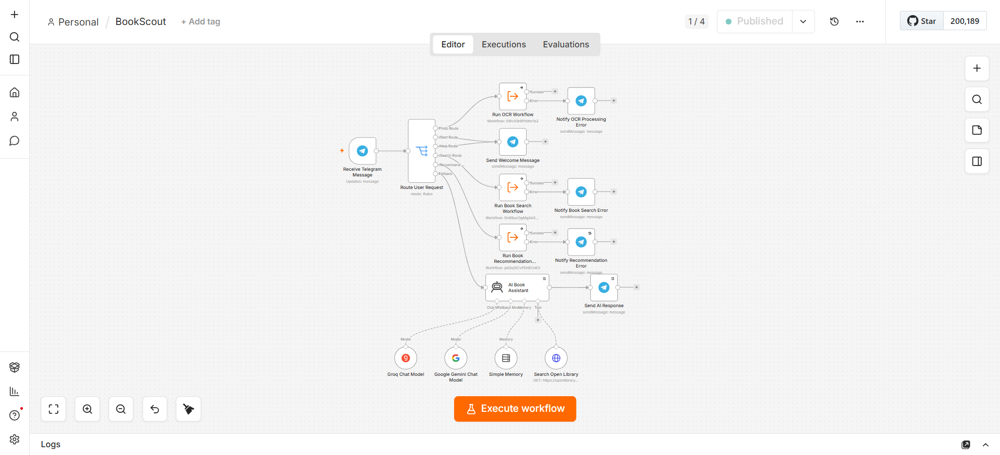
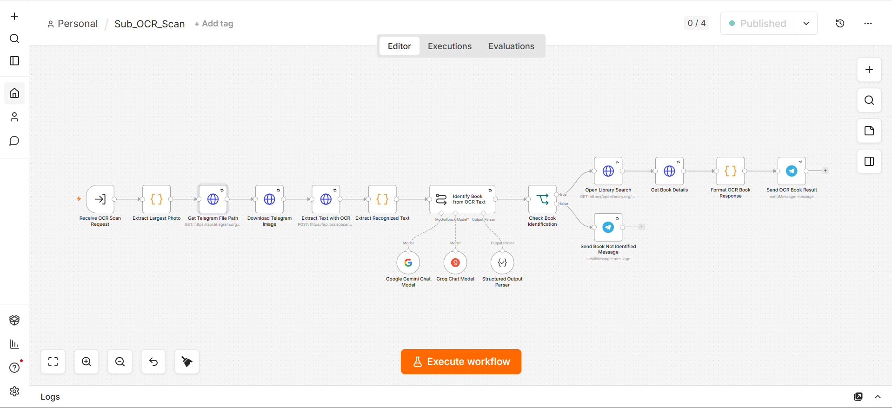
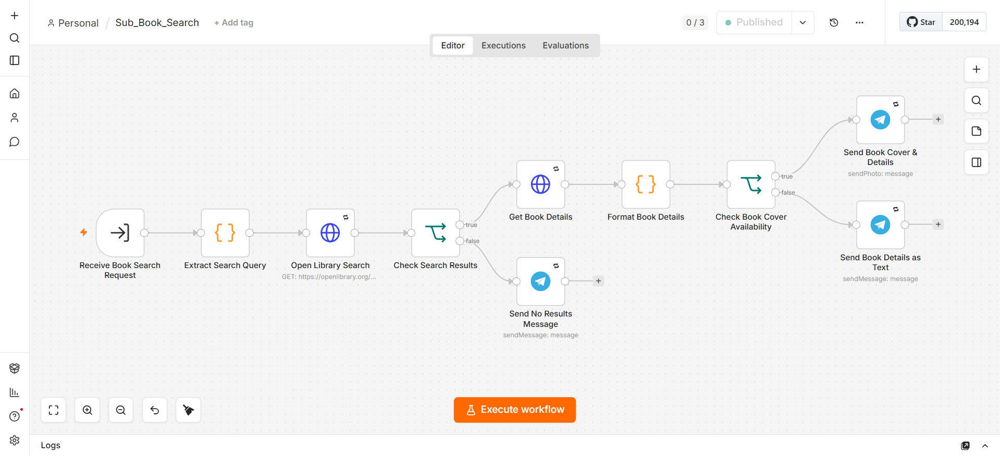
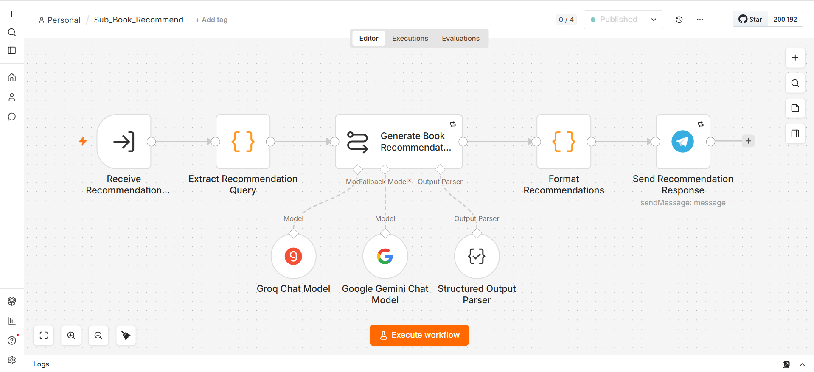
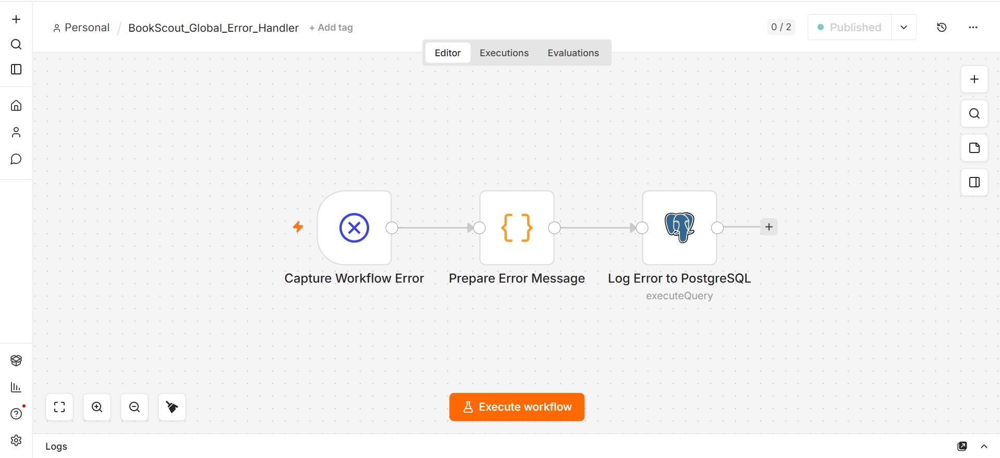

# 📚 BookScout — AI-Powered Book Discovery Automation

An AI-powered Telegram bot that identifies, searches, and recommends books through a fully conversational interface — built entirely in **n8n**, with zero recurring infrastructure cost.

Users can scan a book cover, type a search or recommend command, or just ask naturally ("what should I read after Dune?") — BookScout figures out the intent and routes it automatically.


---

## 📌 Overview
 
BookScout combines **n8n workflow automation**, the **Telegram Bot API**, the **Open Library API**, and **LLM-powered intent handling** (Google Gemini / Groq) into a single automated book discovery assistant — self-hosted via Docker and exposed to Telegram through a **zrok** tunnel.
 
Users can interact with the bot through:
 
- `/start`, `/help` — onboarding and command reference
- `/search <title>` — direct book lookup
- `/recommend <title>` — direct recommendation request
- 📷 **A cover photo** — OCR + vision-LLM identification, no command needed
- 💬 **Natural language** — "tell me about Dune," "what should I read next?" — handled by an AI Agent fallback
A hybrid **Switch + AI Agent** router means structured input (photos, commands) is handled deterministically and instantly, while only genuinely free-form messages consume an LLM call.
 
---

## ✨ Key Features

### 📷 Book Cover Identification

Users can send a photo of a book cover.

The OCR workflow:

1. Receives the Telegram image.
2. Extracts the Telegram file path.
3. Downloads the image.
4. Sends the image to OCR.Space.
5. Extracts the OCR text.
6. Uses an LLM to interpret the extracted text.
7. Identifies the likely book title and author.
8. Searches Open Library for book details.
9. Sends the result back to Telegram.

---

### 🔎 Book Search

Users can search for books using:

```text
/search The Hobbit

The search workflow:

- Extracts the search query
- Queries Open Library
- Retrieves book metadata
- Retrieves available cover information
- Formats the result
- Sends a Telegram response

The workflow also handles cases where:

- No book is found
- A book has no cover image
- The API request fails

---
### ⭐ AI Book Recommendations

Users can request recommendations such as:

```text
/recommend Atomic Habits
```

The recommendation workflow uses an LLM to generate multiple relevant book suggestions.

Each recommendation includes:

- 📖 Book title
- ✍️ Author
- 💡 Reason for recommendation

The goal is to provide explainable recommendations rather than simply returning a list of book titles.

---
### 🧠 Natural Language AI Assistant

Users do not have to use commands.

They can simply ask:

```text
Tell me about Dune.
```

What should I read after The Hobbit?

I loved Harry Potter. What should I read next?

- Messages that do not match predefined routes are sent to the AI Book Assistant.

The agent uses:

- Google Gemini
- Groq fallback model
- Conversation memory
- Open Library search tool

The AI Agent is instructed to use Open Library when factual book information needs to be verified.

---

### 🔀 Hybrid Routing

BookScout uses a hybrid routing approach:

```text
Telegram Message
       │
       ▼
Route User Request
       │
       ├── 📷 Photo
       │      └── OCR Workflow
       │
       ├── /start
       │      └── Welcome Response
       │
       ├── /help
       │      └── Help Response
       │
       ├── /search
       │      └── Book Search Workflow
       │
       ├── /recommend
       │      └── Recommendation Workflow
       │
       └── 💬 Other Text
              └── AI Book Assistant
```

This prevents unnecessary LLM calls for structured requests while still allowing natural conversational interaction.

---

## 🏗️ System Architecture
 

 
---
 
## 🧩 Workflow Breakdown
 
### 1. `BookScout` — Main Router
The entry point. Receives every Telegram message, then routes deterministically:
 
| Route | Condition | Destination |
|---|---|---|
| Photo | Message contains a photo | `Sub_OCR_Scan` |
| `/start`, `/help` | Text starts with command | Static welcome reply |
| `/search` | Text starts with command | `Sub_Book_Search` |
| `/recommend` | Text starts with command | `Sub_Book_Recommend` |
| Fallback | Anything else (free-form text) | **AI Book Assistant** (Gemini/Groq Agent, with conversation memory and an Open Library search tool) |
 
Each sub-workflow call has its own **On Error → error output** branch, notifying the user immediately if that specific route fails.
 
### 2. `Sub_OCR_Scan` — Cover Photo Identification
Downloads the Telegram photo, extracts text via OCR.Space, then passes the raw OCR text to an LLM chain (Gemini, with Groq as fallback) with a **Structured Output Parser** to reliably extract `title` and `author` even from noisy OCR output. Falls back to a "couldn't identify that cover" message if identification fails, rather than passing bad data downstream.
 
### 3. `Sub_Book_Search` — Book Lookup
Queries Open Library, formats the result, and branches on whether a cover image is available — sending a photo-with-caption when possible, or a text-only reply when it isn't. Handles the no-results case explicitly.
 
### 4. `Sub_Book_Recommend` — Recommendations
Uses an LLM chain (Gemini/Groq with fallback) with a Structured Output Parser to generate a ranked list of similar books, each with a stated reason — satisfying the explainability goal of the project rather than returning a bare title list.
 
### 5. `BookScout_Global_Error_Handler`
Catches any execution failure not already handled locally, and logs it to **PostgreSQL** for later review — giving the project an actual audit trail of failures rather than silent errors.

---

## 🖼️ Screenshots

> Save your exported screenshots into a `/screenshots` folder in the repo root, then they'll render below on GitHub automatically.

| Main Router | OCR Sub-Workflow |
|---|---|
|  |  |

| Book Search | Recommendations |
|---|---|
|  |  |

| Global Error Handler |
|---|
|  |

---

## 🛠️ Tech Stack
 
| Layer | Tool |
|---|---|
| Automation engine | [n8n](https://n8n.io) (self-hosted) |
| Containerization | Docker |
| Interface | Telegram Bot API |
| Book metadata | [Open Library API](https://openlibrary.org/developers/api) |
| OCR | [OCR.Space](https://ocr.space/ocrapi) |
| LLM reasoning | Google Gemini + Groq (fallback) |
| Error logging | PostgreSQL |
| Public tunnel | [zrok](https://zrok.io) |
 

---

## 💬 Usage Examples

```
/search The Hobbit
/recommend Atomic Habits
📷 [send a photo of any book cover]
"What should I read after Dune?"
"I loved Harry Potter, what's next?"
```

---

## 👩‍💻 Author

Shravani Mugalikar

AI & Automation Enthusiast


