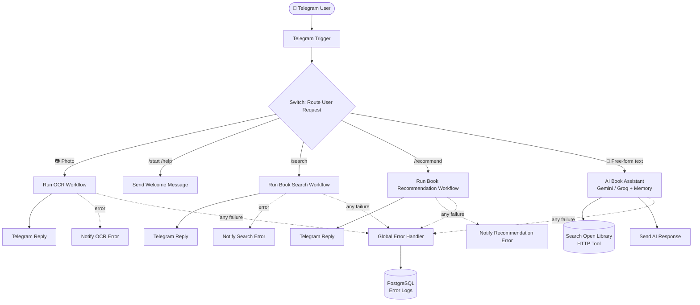

# 📚 BookScout — AI-Powered Book Discovery Automation

An AI-powered Telegram bot that identifies, searches, and recommends books through a fully conversational interface — built entirely in **n8n**, with zero recurring infrastructure cost.

Users can scan a book cover, type a search or recommend command, or just ask naturally ("what should I read after Dune?") — BookScout figures out the intent and routes it automatically.


---

## 📌 Overview

BookScout combines **n8n workflow automation**, the **Telegram Bot API**, the **Open Library API**, and **LLM-powered intent handling** (Google Gemini / Groq) into a single automated book discovery assistant — with no custom backend, no paid APIs, and no server that has to run 24/7 on your own machine.

Users can interact with the bot through:

- `/start`, `/help` — onboarding and command reference
- `/search <title>` — direct book lookup
- `/recommend <title>` — direct recommendation request
- 📷 **A cover photo** — OCR + vision-LLM identification, no command needed
- 💬 **Natural language** — "tell me about Dune," "what should I read next?" — handled by an AI Agent fallback

A hybrid **Switch + AI Agent** router means structured input (photos, commands) is handled deterministically and instantly, while only genuinely free-form messages consume an LLM call — keeping the bot fast, predictable, and within free-tier quotas.

---

## 🎯 Key Features

- 📷 **Photo-based book identification** — OCR (OCR.space) combined with a vision-capable LLM for robust title/author extraction, even from stylized covers
- 🔎 **Book search** via the Open Library API, with graceful no-results and missing-cover handling
- ⭐ **AI-generated, explainable recommendations** — every suggestion states *why* it was chosen (shared author, genre, or theme)
- 🧠 **Hybrid intent routing** — a Switch node handles photos and explicit commands with zero LLM overhead; an AI Agent (with conversational memory) handles free-form natural language
- 🔀 **Modular sub-workflow architecture** — Router, OCR, Search, Recommend, and Error Handler are all independent, independently testable workflows connected via Execute Workflow calls
- 🚨 **Centralized error handling** — every risky node has a local fallback that replies to the user immediately, plus a global handler that logs failures to PostgreSQL for later review
- 🌐 **Webhook-based, always reachable** — deployed on Render with a keep-alive ping, so the bot responds without needing a laptop or local machine running
- 💸 **Zero infrastructure cost** — every API and hosting tier used (Telegram, Open Library, OCR.space, Gemini/Groq free tiers, Render free tier) is free at this project's scale

---

## 🏗️ System Architecture



---

## 🧩 Workflow Breakdown

### 1. `BookScout` — Main Router
The entry point. Receives every Telegram message, then routes deterministically:

| Route | Condition | Destination |
|---|---|---|
| Photo | Message contains a photo | `Sub_OCR_Scan` |
| `/start`, `/help` | Text starts with command | Static welcome reply |
| `/search` | Text starts with command | `Sub_Book_Search` |
| `/recommend` | Text starts with command | `Sub_Book_Recommend` |
| Fallback | Anything else (free-form text) | **AI Book Assistant** (Gemini/Groq Agent, with conversation memory and an Open Library search tool) |

Each sub-workflow call has its own **On Error → error output** branch, notifying the user immediately if that specific route fails.

### 2. `Sub_OCR_Scan` — Cover Photo Identification
Downloads the Telegram photo, extracts text via OCR.space, then passes the raw OCR text to an LLM chain (Gemini, with Groq as fallback) with a **Structured Output Parser** to reliably extract `title` and `author` even from noisy OCR output. Falls back to a "couldn't identify that cover" message if identification fails, rather than passing bad data downstream.

### 3. `Sub_Book_Search` — Book Lookup
Queries Open Library, formats the result, and branches on whether a cover image is available — sending a photo-with-caption when possible, or a text-only reply when it isn't. Handles the no-results case explicitly.

### 4. `Sub_Book_Recommend` — Recommendations
Uses an LLM chain (Gemini/Groq with fallback) with a Structured Output Parser to generate a ranked list of similar books, each with a stated reason — satisfying the explainability goal of the project rather than returning a bare title list.

### 5. `BookScout_Global_Error_Handler`
Catches any execution failure not already handled locally, and logs it to **PostgreSQL** for later review — giving the project an actual audit trail of failures rather than silent errors.

---

## 🖼️ Screenshots

> Save your exported screenshots into a `/screenshots` folder in the repo root, then they'll render below on GitHub automatically.

| Main Router | OCR Sub-Workflow |
|---|---|
|  |  |

| Book Search | Recommendations |
|---|---|
|  |  |

| Global Error Handler |
|---|
|  |

---

## 🛠️ Tech Stack

| Layer | Tool | 
|---|---|---|
| Automation engine | [n8n](https://n8n.io) (self-hosted) |
| Interface | Telegram Bot API | 
| Book metadata | [Open Library API](https://openlibrary.org/developers/api) |
| OCR | [OCR.space](https://ocr.space/ocrapi) |
| LLM reasoning | Google Gemini + Groq (fallback) | 
| Error logging | PostgreSQL |

---

## 🚀 Setup & Deployment

### Local development
```bash
git clone <this-repo>
cd bookscout
docker compose up -d
```
Import the five workflow JSON files from `/workflows` into your local n8n instance, then configure credentials (see below).

### Credentials required
| Credential | Where to get it |
|---|---|
| Telegram Bot Token | [@BotFather](https://t.me/BotFather) on Telegram |
| Google Gemini API Key | [Google AI Studio](https://aistudio.google.com) |
| Groq API Key | [console.groq.com](https://console.groq.com) |
| OCR.space API Key | [ocr.space/ocrapi](https://ocr.space/ocrapi) |

---

## 💬 Usage Examples

```
/search The Hobbit
/recommend Atomic Habits
📷 [send a photo of any book cover]
"What should I read after Dune?"
"I loved Harry Potter, what's next?"
```

---


